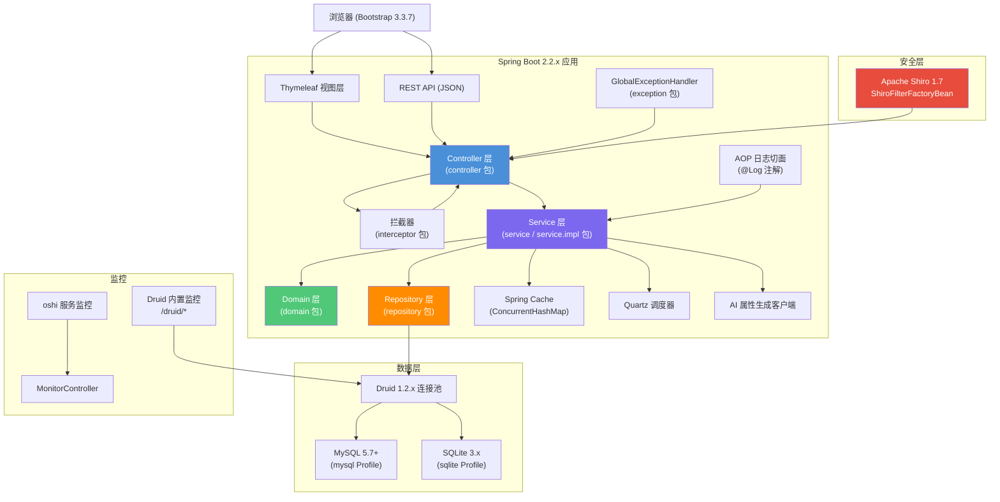
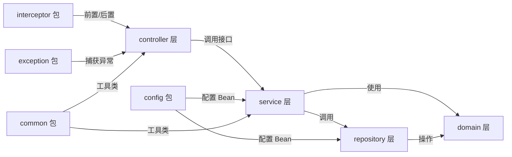

# Spring Boot 企业级管理平台 技术设计文档

> **关联需求**：[需求文档](../01-product-specs/spring-boot-admin-platform-spec.md)
> **文档状态**：已确认
> **创建时间**：2025-01-01
> **最后更新**：2025-01-01
> **负责人**：@team

---

## 概述

本系统基于 Spring Boot 2.2.x 构建企业级 Web 管理平台，采用 Apache Shiro 实现 RBAC 权限体系，MyBatis 作为持久层框架，Thymeleaf + Bootstrap 3.3.7 作为视图层，支持 SQLite/MySQL 双数据库 Profile 切换。系统遵循四层架构约束（controller  service  domain  repository），提供用户/角色/菜单/部门/岗位权限管理、系统监控、无人机信息管理等完整功能模块。

---

## 架构设计

### 整体架构图



### 四层架构依赖关系



### 数据流向

**请求处理流程**：

1. 浏览器发送 HTTP 请求，经 Shiro Filter 鉴权
2. `RequestLoggingInterceptor` 打印请求信息（URL、方法、IP、参数）
3. Controller 接收参数，调用 `@Valid` 校验，转发至 Service
4. Service 执行业务逻辑，调用 Repository 操作数据库
5. AOP 切面拦截 `@Log` 注解方法，异步写入操作日志
6. Service 返回 domain 对象，Controller 包装为 `AjaxResult` 统一响应
7. `RequestLoggingInterceptor` 打印响应状态码和耗时

**异常处理流程**：

1. Service 抛出 `ServiceException` 或参数校验失败
2. `GlobalExceptionHandler` 捕获，返回 `{"code": xxx, "msg": "...", "data": null}`
3. 未预期异常记录堆栈至日志，返回通用错误提示

---
## 包结构设计

```
com.md.basePlatform/
 BasePlatformApplication.java          # Spring Boot 启动类

 config/                               # Spring 配置类
    ShiroConfig.java                  # Shiro 安全配置
    DruidConfig.java                  # Druid 数据源配置
    MyBatisConfig.java                # MyBatis 配置
    CacheConfig.java                  # Spring Cache 配置（ConcurrentHashMap）
    QuartzConfig.java                 # Quartz 调度器配置
    CorsConfig.java                   # 跨域配置
    FileUploadConfig.java             # 文件上传配置
    WebMvcConfig.java                 # MVC 配置（注册拦截器）

 common/                               # 公共工具与常量
    constant/
       Constants.java                # 系统常量
       UserConstants.java            # 用户相关常量
       CacheConstants.java           # 缓存 Key 常量
    enums/
       BusinessType.java             # 操作类型枚举（INSERT/UPDATE/DELETE...）
       DataScopeType.java            # 数据权限范围枚举
       MenuType.java                 # 菜单类型枚举（目录/菜单/按钮）
    utils/
        SecurityUtils.java            # Shiro 安全工具类
        StringUtils.java              # 字符串工具类
        DateUtils.java                # 日期工具类
        IpUtils.java                  # IP 地址工具类
        Md5Utils.java                 # MD5 加盐哈希工具类
        PageUtils.java                # 分页工具类
        ExcelUtils.java               # Excel 导入导出工具类（POI）

 interceptor/                          # 拦截器（独立包）
    RequestLoggingInterceptor.java    # 请求日志拦截器

 exception/                            # 异常定义与处理
    ServiceException.java             # 业务异常
    FileUploadException.java          # 文件上传异常
    GlobalExceptionHandler.java       # 全局异常处理器（@ControllerAdvice）

 annotation/                           # 自定义注解
    Log.java                          # 操作日志注解

 aspect/                               # AOP 切面
    LogAspect.java                    # 操作日志切面

 controller/                           # 表现层
    LoginController.java              # 登录/退出
    IndexController.java              # 首页
    system/
       UserController.java
       DeptController.java
       PostController.java
       MenuController.java
       RoleController.java
       DictTypeController.java
       DictDataController.java
       ConfigController.java         # 参数管理
       NoticeController.java
    monitor/
       OnlineController.java         # 在线用户
       JobController.java            # 定时任务
       JobLogController.java         # 任务日志
       ServerController.java         # 服务监控
       CacheController.java          # 缓存监控
       OperLogController.java        # 操作日志
    drone/
       DroneController.java          # 无人机管理
    tool/
        GenController.java            # 代码生成器

 service/                              # Service 接口
    IUserService.java
    IDeptService.java
    IPostService.java
    IMenuService.java
    IRoleService.java
    IDictTypeService.java
    IDictDataService.java
    IConfigService.java
    INoticeService.java
    IOperLogService.java
    IOnlineService.java
    IJobService.java
    IJobLogService.java
    IDroneService.java
    IAiService.java
    IGenService.java

 service/impl/                         # Service 实现
    UserServiceImpl.java
    DeptServiceImpl.java
    PostServiceImpl.java
    MenuServiceImpl.java
    RoleServiceImpl.java
    DictTypeServiceImpl.java
    DictDataServiceImpl.java
    ConfigServiceImpl.java
    NoticeServiceImpl.java
    OperLogServiceImpl.java
    OnlineServiceImpl.java
    JobServiceImpl.java
    JobLogServiceImpl.java
    DroneServiceImpl.java
    AiServiceImpl.java
    GenServiceImpl.java

 domain/                               # 领域模型（纯 POJO）
    SysUser.java
    SysDept.java
    SysPost.java
    SysMenu.java
    SysRole.java
    SysDictType.java
    SysDictData.java
    SysConfig.java
    SysNotice.java
    SysOperLog.java
    SysJob.java
    SysJobLog.java
    DroneInfo.java
    dto/                              # 数据传输对象
        AjaxResult.java               # 统一响应包装
        TableDataInfo.java            # 分页响应包装
        LoginBody.java                # 登录请求 DTO
        UserQueryDTO.java
        DroneQueryDTO.java
        ServerInfo.java               # 服务器信息 DTO（oshi）

 repository/                           # MyBatis Mapper 接口
     SysUserMapper.java
     SysDeptMapper.java
     SysPostMapper.java
     SysMenuMapper.java
     SysRoleMapper.java
     SysUserRoleMapper.java            # 用户-角色关联
     SysUserPostMapper.java            # 用户-岗位关联
     SysRoleMenuMapper.java            # 角色-菜单关联
     SysRoleDeptMapper.java            # 角色-部门关联（自定义数据权限）
     SysDictTypeMapper.java
     SysDictDataMapper.java
     SysConfigMapper.java
     SysNoticeMapper.java
     SysOperLogMapper.java
     SysJobMapper.java
     SysJobLogMapper.java
     DroneInfoMapper.java
```

**resources 目录结构**：

```
src/main/resources/
 application.yml                       # 主配置（激活 Profile）
 application-sqlite.yml                # SQLite Profile 配置
 application-mysql.yml                 # MySQL Profile 配置
 mapper/                               # MyBatis XML（仅复杂 SQL）
    SysUserMapper.xml
    SysDeptMapper.xml
    SysMenuMapper.xml
    SysRoleMapper.xml
    SysOperLogMapper.xml
    SysJobMapper.xml
    DroneInfoMapper.xml
 sql/
    schema-mysql.sql                  # MySQL DDL 初始化脚本
    schema-sqlite.sql                 # SQLite DDL 初始化脚本
 templates/                            # Thymeleaf 模板
     login.html
     index.html
     main.html
     system/
        user/list.html
        dept/list.html
        post/list.html
        menu/list.html
        role/list.html
        dict/list.html
        config/list.html
        notice/list.html
     monitor/
        online/list.html
        job/list.html
        server/index.html
        cache/index.html
     drone/
         list.html
```

---
## 核心数据模型

### 数据库表字段定义

#### sys_user（系统用户表）

| 字段名 | Java 类型 | MySQL 类型 | SQLite 类型 | 约束 | 说明 |
|--------|-----------|-----------|------------|------|------|
| user_id | Long | BIGINT | INTEGER | PK, AUTO_INCREMENT | 用户 ID |
| dept_id | Long | BIGINT | INTEGER | FK | 所属部门 ID |
| user_name | String | VARCHAR(30) | TEXT | NOT NULL, UNIQUE | 用户名 |
| nick_name | String | VARCHAR(30) | TEXT | NOT NULL | 用户昵称 |
| email | String | VARCHAR(50) | TEXT | | 邮箱 |
| phonenumber | String | VARCHAR(11) | TEXT | | 手机号 |
| sex | String | CHAR(1) | TEXT | DEFAULT '0' | 性别（0男1女2未知） |
| avatar | String | VARCHAR(100) | TEXT | | 头像路径 |
| password | String | VARCHAR(100) | TEXT | NOT NULL | 密码（MD5加盐） |
| salt | String | VARCHAR(20) | TEXT | NOT NULL | 密码盐值 |
| status | String | CHAR(1) | TEXT | DEFAULT '0' | 状态（0正常1停用） |
| login_ip | String | VARCHAR(128) | TEXT | | 最后登录IP |
| login_date | Date | DATETIME | TEXT | | 最后登录时间 |
| create_by | String | VARCHAR(64) | TEXT | | 创建者 |
| create_time | Date | DATETIME | TEXT | | 创建时间 |
| update_by | String | VARCHAR(64) | TEXT | | 更新者 |
| update_time | Date | DATETIME | TEXT | | 更新时间 |
| remark | String | VARCHAR(500) | TEXT | | 备注 |
| del_flag | String | CHAR(1) | TEXT | DEFAULT '0' | 删除标志（0正常2删除） |

#### sys_dept（部门表）

| 字段名 | Java 类型 | MySQL 类型 | SQLite 类型 | 约束 | 说明 |
|--------|-----------|-----------|------------|------|------|
| dept_id | Long | BIGINT | INTEGER | PK | 部门 ID |
| parent_id | Long | BIGINT | INTEGER | DEFAULT 0 | 父部门 ID |
| ancestors | String | VARCHAR(50) | TEXT | | 祖级列表（逗号分隔） |
| dept_name | String | VARCHAR(30) | TEXT | NOT NULL | 部门名称 |
| order_num | Integer | INT | INTEGER | DEFAULT 0 | 显示顺序 |
| leader | String | VARCHAR(20) | TEXT | | 负责人 |
| phone | String | VARCHAR(11) | TEXT | | 联系电话 |
| email | String | VARCHAR(50) | TEXT | | 邮箱 |
| status | String | CHAR(1) | TEXT | DEFAULT '0' | 状态（0正常1停用） |
| del_flag | String | CHAR(1) | TEXT | DEFAULT '0' | 删除标志 |
| create_by | String | VARCHAR(64) | TEXT | | 创建者 |
| create_time | Date | DATETIME | TEXT | | 创建时间 |

#### sys_role（角色表）

| 字段名 | Java 类型 | MySQL 类型 | SQLite 类型 | 约束 | 说明 |
|--------|-----------|-----------|------------|------|------|
| role_id | Long | BIGINT | INTEGER | PK | 角色 ID |
| role_name | String | VARCHAR(30) | TEXT | NOT NULL | 角色名称 |
| role_key | String | VARCHAR(100) | TEXT | NOT NULL, UNIQUE | 角色权限字符串 |
| role_sort | Integer | INT | INTEGER | NOT NULL | 显示顺序 |
| data_scope | String | CHAR(1) | TEXT | DEFAULT '1' | 数据范围（1全部2自定义3本部门4本部门及子部门5仅本人） |
| status | String | CHAR(1) | TEXT | DEFAULT '0' | 状态 |
| del_flag | String | CHAR(1) | TEXT | DEFAULT '0' | 删除标志 |
| create_by | String | VARCHAR(64) | TEXT | | 创建者 |
| create_time | Date | DATETIME | TEXT | | 创建时间 |
| remark | String | VARCHAR(500) | TEXT | | 备注 |

#### sys_menu（菜单权限表）

| 字段名 | Java 类型 | MySQL 类型 | SQLite 类型 | 约束 | 说明 |
|--------|-----------|-----------|------------|------|------|
| menu_id | Long | BIGINT | INTEGER | PK | 菜单 ID |
| menu_name | String | VARCHAR(50) | TEXT | NOT NULL | 菜单名称 |
| parent_id | Long | BIGINT | INTEGER | DEFAULT 0 | 父菜单 ID |
| order_num | Integer | INT | INTEGER | DEFAULT 0 | 显示顺序 |
| path | String | VARCHAR(200) | TEXT | | 路由地址 |
| component | String | VARCHAR(255) | TEXT | | 组件路径 |
| is_frame | Integer | INT | INTEGER | DEFAULT 1 | 是否外链（0是1否） |
| menu_type | String | CHAR(1) | TEXT | | 菜单类型（M目录C菜单F按钮） |
| visible | String | CHAR(1) | TEXT | DEFAULT '0' | 显示状态（0显示1隐藏） |
| status | String | CHAR(1) | TEXT | DEFAULT '0' | 状态（0正常1停用） |
| perms | String | VARCHAR(100) | TEXT | | 权限标识（如 system:user:add） |
| icon | String | VARCHAR(100) | TEXT | DEFAULT '#' | 菜单图标 |
| create_by | String | VARCHAR(64) | TEXT | | 创建者 |
| create_time | Date | DATETIME | TEXT | | 创建时间 |
| remark | String | VARCHAR(500) | TEXT | | 备注 |

#### sys_job（定时任务表）

| 字段名 | Java 类型 | MySQL 类型 | SQLite 类型 | 约束 | 说明 |
|--------|-----------|-----------|------------|------|------|
| job_id | Long | BIGINT | INTEGER | PK | 任务 ID |
| job_name | String | VARCHAR(64) | TEXT | NOT NULL | 任务名称 |
| job_group | String | VARCHAR(64) | TEXT | DEFAULT 'DEFAULT' | 任务组名 |
| invoke_target | String | VARCHAR(500) | TEXT | NOT NULL | 调用目标（Bean.method） |
| cron_expression | String | VARCHAR(255) | TEXT | | Cron 表达式 |
| misfire_policy | String | VARCHAR(20) | TEXT | DEFAULT '3' | 计划执行错误策略（1立即执行2执行一次3放弃执行） |
| concurrent | String | CHAR(1) | TEXT | DEFAULT '1' | 是否并发执行（0允许1禁止） |
| status | String | CHAR(1) | TEXT | DEFAULT '0' | 状态（0正常1暂停） |
| create_by | String | VARCHAR(64) | TEXT | | 创建者 |
| create_time | Date | DATETIME | TEXT | | 创建时间 |
| remark | String | VARCHAR(500) | TEXT | | 备注 |

#### drone_info（无人机信息表）

| 字段名 | Java 类型 | MySQL 类型 | SQLite 类型 | 约束 | 说明 |
|--------|-----------|-----------|------------|------|------|
| drone_id | Long | BIGINT | INTEGER | PK | 无人机 ID |
| drone_no | String | VARCHAR(50) | TEXT | NOT NULL, UNIQUE | 无人机编号 |
| model | String | VARCHAR(100) | TEXT | | 型号 |
| manufacturer | String | VARCHAR(100) | TEXT | | 制造商 |
| max_payload | BigDecimal | DECIMAL(10,2) | REAL | | 最大载重（kg） |
| max_flight_time | Integer | INT | INTEGER | | 最大飞行时间（分钟） |
| max_speed | BigDecimal | DECIMAL(10,2) | REAL | | 最大飞行速度（m/s） |
| max_altitude | Integer | INT | INTEGER | | 最大飞行高度（m） |
| category | String | VARCHAR(50) | TEXT | | 用途分类 |
| ai_generated | String | CHAR(1) | TEXT | DEFAULT '0' | AI 生成标志（0否1是） |
| status | String | CHAR(1) | TEXT | DEFAULT '0' | 状态（0正常1停用） |
| dept_id | Long | BIGINT | INTEGER | FK | 所属部门（数据权限） |
| create_by | String | VARCHAR(64) | TEXT | | 创建者 |
| create_time | Date | DATETIME | TEXT | | 创建时间 |
| update_by | String | VARCHAR(64) | TEXT | | 更新者 |
| update_time | Date | DATETIME | TEXT | | 更新时间 |
| remark | String | VARCHAR(500) | TEXT | | 备注 |

### MySQL DDL 初始化脚本（核心表）

```sql
-- MySQL 5.7+ 兼容
CREATE TABLE `sys_user` (
  `user_id`     BIGINT(20)   NOT NULL AUTO_INCREMENT COMMENT '用户ID',
  `dept_id`     BIGINT(20)            DEFAULT NULL   COMMENT '部门ID',
  `user_name`   VARCHAR(30)  NOT NULL                COMMENT '用户账号',
  `nick_name`   VARCHAR(30)  NOT NULL                COMMENT '用户昵称',
  `email`       VARCHAR(50)           DEFAULT ''     COMMENT '用户邮箱',
  `phonenumber` VARCHAR(11)           DEFAULT ''     COMMENT '手机号码',
  `sex`         CHAR(1)               DEFAULT '0'    COMMENT '用户性别（0男 1女 2未知）',
  `avatar`      VARCHAR(100)          DEFAULT ''     COMMENT '头像地址',
  `password`    VARCHAR(100)          DEFAULT ''     COMMENT '密码',
  `salt`        VARCHAR(20)           DEFAULT ''     COMMENT '盐值',
  `status`      CHAR(1)               DEFAULT '0'    COMMENT '帐号状态（0正常 1停用）',
  `del_flag`    CHAR(1)               DEFAULT '0'    COMMENT '删除标志（0代表存在 2代表删除）',
  `login_ip`    VARCHAR(128)          DEFAULT ''     COMMENT '最后登录IP',
  `login_date`  DATETIME                             COMMENT '最后登录时间',
  `create_by`   VARCHAR(64)           DEFAULT ''     COMMENT '创建者',
  `create_time` DATETIME                             COMMENT '创建时间',
  `update_by`   VARCHAR(64)           DEFAULT ''     COMMENT '更新者',
  `update_time` DATETIME                             COMMENT '更新时间',
  `remark`      VARCHAR(500)          DEFAULT NULL   COMMENT '备注',
  PRIMARY KEY (`user_id`),
  UNIQUE KEY `uk_user_name` (`user_name`)
) ENGINE=InnoDB DEFAULT CHARSET=utf8mb4 COMMENT='用户信息表';

CREATE TABLE `sys_dept` (
  `dept_id`     BIGINT(20)   NOT NULL AUTO_INCREMENT COMMENT '部门id',
  `parent_id`   BIGINT(20)            DEFAULT 0      COMMENT '父部门id',
  `ancestors`   VARCHAR(50)           DEFAULT ''     COMMENT '祖级列表',
  `dept_name`   VARCHAR(30)           DEFAULT ''     COMMENT '部门名称',
  `order_num`   INT(4)                DEFAULT 0      COMMENT '显示顺序',
  `leader`      VARCHAR(20)           DEFAULT NULL   COMMENT '负责人',
  `phone`       VARCHAR(11)           DEFAULT NULL   COMMENT '联系电话',
  `email`       VARCHAR(50)           DEFAULT NULL   COMMENT '邮箱',
  `status`      CHAR(1)               DEFAULT '0'    COMMENT '部门状态（0正常 1停用）',
  `del_flag`    CHAR(1)               DEFAULT '0'    COMMENT '删除标志',
  `create_by`   VARCHAR(64)           DEFAULT ''     COMMENT '创建者',
  `create_time` DATETIME                             COMMENT '创建时间',
  PRIMARY KEY (`dept_id`)
) ENGINE=InnoDB DEFAULT CHARSET=utf8mb4 COMMENT='部门表';

CREATE TABLE `sys_role` (
  `role_id`     BIGINT(20)   NOT NULL AUTO_INCREMENT COMMENT '角色ID',
  `role_name`   VARCHAR(30)  NOT NULL                COMMENT '角色名称',
  `role_key`    VARCHAR(100) NOT NULL                COMMENT '角色权限字符串',
  `role_sort`   INT(4)       NOT NULL                COMMENT '显示顺序',
  `data_scope`  CHAR(1)               DEFAULT '1'    COMMENT '数据范围（1全部 2自定义 3本部门 4本部门及子部门 5仅本人）',
  `status`      CHAR(1)      NOT NULL                COMMENT '角色状态（0正常 1停用）',
  `del_flag`    CHAR(1)               DEFAULT '0'    COMMENT '删除标志',
  `create_by`   VARCHAR(64)           DEFAULT ''     COMMENT '创建者',
  `create_time` DATETIME                             COMMENT '创建时间',
  `remark`      VARCHAR(500)          DEFAULT NULL   COMMENT '备注',
  PRIMARY KEY (`role_id`)
) ENGINE=InnoDB DEFAULT CHARSET=utf8mb4 COMMENT='角色信息表';

CREATE TABLE `sys_menu` (
  `menu_id`     BIGINT(20)   NOT NULL AUTO_INCREMENT COMMENT '菜单ID',
  `menu_name`   VARCHAR(50)  NOT NULL                COMMENT '菜单名称',
  `parent_id`   BIGINT(20)            DEFAULT 0      COMMENT '父菜单ID',
  `order_num`   INT(4)                DEFAULT 0      COMMENT '显示顺序',
  `path`        VARCHAR(200)          DEFAULT ''     COMMENT '路由地址',
  `component`   VARCHAR(255)          DEFAULT NULL   COMMENT '组件路径',
  `is_frame`    INT(1)                DEFAULT 1      COMMENT '是否为外链（0是 1否）',
  `menu_type`   CHAR(1)               DEFAULT ''     COMMENT '菜单类型（M目录 C菜单 F按钮）',
  `visible`     CHAR(1)               DEFAULT '0'    COMMENT '菜单状态（0显示 1隐藏）',
  `status`      CHAR(1)               DEFAULT '0'    COMMENT '菜单状态（0正常 1停用）',
  `perms`       VARCHAR(100)          DEFAULT NULL   COMMENT '权限标识',
  `icon`        VARCHAR(100)          DEFAULT '#'    COMMENT '菜单图标',
  `create_by`   VARCHAR(64)           DEFAULT ''     COMMENT '创建者',
  `create_time` DATETIME                             COMMENT '创建时间',
  `remark`      VARCHAR(500)          DEFAULT ''     COMMENT '备注',
  PRIMARY KEY (`menu_id`)
) ENGINE=InnoDB DEFAULT CHARSET=utf8mb4 COMMENT='菜单权限表';

CREATE TABLE `sys_user_role` (
  `user_id` BIGINT(20) NOT NULL COMMENT '用户ID',
  `role_id` BIGINT(20) NOT NULL COMMENT '角色ID',
  PRIMARY KEY (`user_id`, `role_id`)
) ENGINE=InnoDB DEFAULT CHARSET=utf8mb4 COMMENT='用户和角色关联表';

CREATE TABLE `sys_role_menu` (
  `role_id` BIGINT(20) NOT NULL COMMENT '角色ID',
  `menu_id` BIGINT(20) NOT NULL COMMENT '菜单ID',
  PRIMARY KEY (`role_id`, `menu_id`)
) ENGINE=InnoDB DEFAULT CHARSET=utf8mb4 COMMENT='角色和菜单关联表';

CREATE TABLE `sys_role_dept` (
  `role_id` BIGINT(20) NOT NULL COMMENT '角色ID',
  `dept_id` BIGINT(20) NOT NULL COMMENT '部门ID',
  PRIMARY KEY (`role_id`, `dept_id`)
) ENGINE=InnoDB DEFAULT CHARSET=utf8mb4 COMMENT='角色和部门关联表';

CREATE TABLE `sys_dict_type` (
  `dict_id`     BIGINT(20)   NOT NULL AUTO_INCREMENT COMMENT '字典主键',
  `dict_name`   VARCHAR(100)          DEFAULT ''     COMMENT '字典名称',
  `dict_type`   VARCHAR(100)          DEFAULT ''     COMMENT '字典类型',
  `status`      CHAR(1)               DEFAULT '0'    COMMENT '状态（0正常 1停用）',
  `create_by`   VARCHAR(64)           DEFAULT ''     COMMENT '创建者',
  `create_time` DATETIME                             COMMENT '创建时间',
  `remark`      VARCHAR(500)          DEFAULT NULL   COMMENT '备注',
  PRIMARY KEY (`dict_id`),
  UNIQUE KEY `uk_dict_type` (`dict_type`)
) ENGINE=InnoDB DEFAULT CHARSET=utf8mb4 COMMENT='字典类型表';

CREATE TABLE `sys_dict_data` (
  `dict_code`   BIGINT(20)   NOT NULL AUTO_INCREMENT COMMENT '字典编码',
  `dict_sort`   INT(4)                DEFAULT 0      COMMENT '字典排序',
  `dict_label`  VARCHAR(100)          DEFAULT ''     COMMENT '字典标签',
  `dict_value`  VARCHAR(100)          DEFAULT ''     COMMENT '字典键值',
  `dict_type`   VARCHAR(100)          DEFAULT ''     COMMENT '字典类型',
  `css_class`   VARCHAR(100)          DEFAULT NULL   COMMENT '样式属性',
  `list_class`  VARCHAR(100)          DEFAULT NULL   COMMENT '表格回显样式',
  `is_default`  CHAR(1)               DEFAULT 'N'    COMMENT '是否默认（Y是 N否）',
  `status`      CHAR(1)               DEFAULT '0'    COMMENT '状态（0正常 1停用）',
  `create_by`   VARCHAR(64)           DEFAULT ''     COMMENT '创建者',
  `create_time` DATETIME                             COMMENT '创建时间',
  `remark`      VARCHAR(500)          DEFAULT NULL   COMMENT '备注',
  PRIMARY KEY (`dict_code`)
) ENGINE=InnoDB DEFAULT CHARSET=utf8mb4 COMMENT='字典数据表';

CREATE TABLE `sys_config` (
  `config_id`    BIGINT(20)   NOT NULL AUTO_INCREMENT COMMENT '参数主键',
  `config_name`  VARCHAR(100)          DEFAULT ''     COMMENT '参数名称',
  `config_key`   VARCHAR(100)          DEFAULT ''     COMMENT '参数键名',
  `config_value` VARCHAR(500)          DEFAULT ''     COMMENT '参数键值',
  `config_type`  CHAR(1)               DEFAULT 'N'    COMMENT '系统内置（Y是 N否）',
  `create_by`    VARCHAR(64)           DEFAULT ''     COMMENT '创建者',
  `create_time`  DATETIME                             COMMENT '创建时间',
  `remark`       VARCHAR(500)          DEFAULT NULL   COMMENT '备注',
  PRIMARY KEY (`config_id`),
  UNIQUE KEY `uk_config_key` (`config_key`)
) ENGINE=InnoDB DEFAULT CHARSET=utf8mb4 COMMENT='参数配置表';

CREATE TABLE `sys_oper_log` (
  `oper_id`      BIGINT(20)    NOT NULL AUTO_INCREMENT COMMENT '日志主键',
  `title`        VARCHAR(50)            DEFAULT ''     COMMENT '模块标题',
  `business_type` INT(2)                DEFAULT 0      COMMENT '业务类型（0其它 1新增 2修改 3删除）',
  `method`       VARCHAR(100)           DEFAULT ''     COMMENT '方法名称',
  `request_method` VARCHAR(10)          DEFAULT ''     COMMENT '请求方式',
  `operator_type` INT(1)                DEFAULT 0      COMMENT '操作类别（0其它 1后台用户 2手机端用户）',
  `oper_name`    VARCHAR(50)            DEFAULT ''     COMMENT '操作人员',
  `dept_name`    VARCHAR(50)            DEFAULT ''     COMMENT '部门名称',
  `oper_url`     VARCHAR(255)           DEFAULT ''     COMMENT '请求URL',
  `oper_ip`      VARCHAR(128)           DEFAULT ''     COMMENT '主机地址',
  `oper_param`   VARCHAR(2000)          DEFAULT ''     COMMENT '请求参数',
  `json_result`  VARCHAR(2000)          DEFAULT ''     COMMENT '返回参数',
  `status`       INT(1)                 DEFAULT 0      COMMENT '操作状态（0正常 1异常）',
  `error_msg`    VARCHAR(2000)          DEFAULT ''     COMMENT '错误消息',
  `oper_time`    DATETIME                              COMMENT '操作时间',
  PRIMARY KEY (`oper_id`)
) ENGINE=InnoDB DEFAULT CHARSET=utf8mb4 COMMENT='操作日志记录';

CREATE TABLE `sys_job` (
  `job_id`          BIGINT(20)   NOT NULL AUTO_INCREMENT COMMENT '任务ID',
  `job_name`        VARCHAR(64)  NOT NULL DEFAULT ''     COMMENT '任务名称',
  `job_group`       VARCHAR(64)  NOT NULL DEFAULT 'DEFAULT' COMMENT '任务组名',
  `invoke_target`   VARCHAR(500) NOT NULL                COMMENT '调用目标字符串',
  `cron_expression` VARCHAR(255)          DEFAULT ''     COMMENT 'cron执行表达式',
  `misfire_policy`  VARCHAR(20)           DEFAULT '3'    COMMENT '计划执行错误策略（1立即执行 2执行一次 3放弃执行）',
  `concurrent`      CHAR(1)               DEFAULT '1'    COMMENT '是否并发执行（0允许 1禁止）',
  `status`          CHAR(1)               DEFAULT '0'    COMMENT '状态（0正常 1暂停）',
  `create_by`       VARCHAR(64)           DEFAULT ''     COMMENT '创建者',
  `create_time`     DATETIME                             COMMENT '创建时间',
  `remark`          VARCHAR(500)          DEFAULT ''     COMMENT '备注信息',
  PRIMARY KEY (`job_id`, `job_name`, `job_group`)
) ENGINE=InnoDB DEFAULT CHARSET=utf8mb4 COMMENT='定时任务调度表';

CREATE TABLE `sys_job_log` (
  `job_log_id`    BIGINT(20)    NOT NULL AUTO_INCREMENT COMMENT '任务日志ID',
  `job_name`      VARCHAR(64)   NOT NULL                COMMENT '任务名称',
  `job_group`     VARCHAR(64)   NOT NULL                COMMENT '任务组名',
  `invoke_target` VARCHAR(500)  NOT NULL                COMMENT '调用目标字符串',
  `job_message`   VARCHAR(500)                          COMMENT '日志信息',
  `status`        CHAR(1)                DEFAULT '0'    COMMENT '执行状态（0正常 1失败）',
  `exception_info` VARCHAR(2000)         DEFAULT ''     COMMENT '异常信息',
  `create_time`   DATETIME                              COMMENT '创建时间',
  PRIMARY KEY (`job_log_id`)
) ENGINE=InnoDB DEFAULT CHARSET=utf8mb4 COMMENT='定时任务调度日志表';

CREATE TABLE `drone_info` (
  `drone_id`        BIGINT(20)    NOT NULL AUTO_INCREMENT COMMENT '无人机ID',
  `drone_no`        VARCHAR(50)   NOT NULL                COMMENT '无人机编号',
  `model`           VARCHAR(100)           DEFAULT ''     COMMENT '型号',
  `manufacturer`    VARCHAR(100)           DEFAULT ''     COMMENT '制造商',
  `max_payload`     DECIMAL(10,2)          DEFAULT NULL   COMMENT '最大载重(kg)',
  `max_flight_time` INT(11)                DEFAULT NULL   COMMENT '最大飞行时间(分钟)',
  `max_speed`       DECIMAL(10,2)          DEFAULT NULL   COMMENT '最大飞行速度(m/s)',
  `max_altitude`    INT(11)                DEFAULT NULL   COMMENT '最大飞行高度(m)',
  `category`        VARCHAR(50)            DEFAULT ''     COMMENT '用途分类',
  `ai_generated`    CHAR(1)                DEFAULT '0'    COMMENT 'AI生成标志（0否 1是）',
  `status`          CHAR(1)                DEFAULT '0'    COMMENT '状态（0正常 1停用）',
  `dept_id`         BIGINT(20)             DEFAULT NULL   COMMENT '所属部门',
  `create_by`       VARCHAR(64)            DEFAULT ''     COMMENT '创建者',
  `create_time`     DATETIME                              COMMENT '创建时间',
  `update_by`       VARCHAR(64)            DEFAULT ''     COMMENT '更新者',
  `update_time`     DATETIME                              COMMENT '更新时间',
  `remark`          VARCHAR(500)           DEFAULT NULL   COMMENT '备注',
  PRIMARY KEY (`drone_id`),
  UNIQUE KEY `uk_drone_no` (`drone_no`)
) ENGINE=InnoDB DEFAULT CHARSET=utf8mb4 COMMENT='无人机信息表';
```

### SQLite DDL 差异说明

SQLite 不支持 `AUTO_INCREMENT`（使用 `AUTOINCREMENT`）、`ENGINE`、`CHARSET`、`COMMENT` 等 MySQL 特有语法。SQLite 版本使用 `INTEGER PRIMARY KEY AUTOINCREMENT`，`DATETIME` 字段使用 `TEXT` 类型存储 ISO 8601 格式字符串，`DECIMAL` 使用 `REAL`。

---
## 各模块接口设计

### 统一响应格式

```java
// domain/dto/AjaxResult.java
public class AjaxResult extends HashMap<String, Object> {
    public static final String CODE_TAG = "code";
    public static final String MSG_TAG  = "msg";
    public static final String DATA_TAG = "data";

    public static AjaxResult success()                    // 200
    public static AjaxResult success(Object data)         // 200 + data
    public static AjaxResult error(String msg)            // 500
    public static AjaxResult error(int code, String msg)  // 自定义错误码
}

// domain/dto/TableDataInfo.java（分页响应）
public class TableDataInfo {
    private long    total;   // 总记录数
    private List<?> rows;    // 数据列表
    private int     code;    // 状态码
    private String  msg;     // 消息
}
```

### 认证模块（AuthModule）

**Controller 路径**：

| 方法 | 路径 | 说明 |
|------|------|------|
| GET | `/login` | 登录页面 |
| POST | `/login` | 登录提交 |
| GET | `/logout` | 退出登录 |
| GET | `/captchaImage` | 获取验证码图片 |

**Service 接口**：

```java
// service/IUserService.java（认证相关方法）
public interface IUserService {
    /** 根据用户名查询用户（含角色、权限） */
    SysUser selectUserByUserName(String userName);
    /** 校验用户名唯一性 */
    String checkUserNameUnique(SysUser user);
    /** 重置用户密码 */
    int resetUserPwd(String userName, String password);
}
```

### 用户管理模块（UserModule）

**Controller 路径**：`/system/user`

| 方法 | 路径 | 说明 | 权限标识 |
|------|------|------|---------|
| GET | `/system/user` | 用户列表页面 | `system:user:view` |
| GET | `/system/user/list` | 分页查询用户列表（JSON） | `system:user:list` |
| POST | `/system/user/add` | 新增用户 | `system:user:add` |
| PUT | `/system/user/edit` | 修改用户 | `system:user:edit` |
| DELETE | `/system/user/remove/{userIds}` | 删除用户（批量） | `system:user:remove` |
| POST | `/system/user/resetPwd` | 重置密码 | `system:user:resetPwd` |
| POST | `/system/user/changeStatus` | 修改状态 | `system:user:edit` |
| POST | `/system/user/importData` | 导入用户 | `system:user:import` |
| GET | `/system/user/export` | 导出用户 | `system:user:export` |

**Service 接口**：

```java
public interface IUserService {
    TableDataInfo selectUserList(SysUser user, PageDomain page);
    SysUser selectUserById(Long userId);
    int insertUser(SysUser user);
    int updateUser(SysUser user);
    int deleteUserByIds(Long[] userIds);
    String importUser(List<SysUser> userList, Boolean isUpdateSupport, String operName);
    List<SysUser> exportUserList(SysUser user);
}
```

### 部门管理模块（DeptModule）

**Controller 路径**：`/system/dept`

| 方法 | 路径 | 说明 | 权限标识 |
|------|------|------|---------|
| GET | `/system/dept` | 部门列表页面 | `system:dept:view` |
| GET | `/system/dept/list` | 查询部门树列表 | `system:dept:list` |
| POST | `/system/dept/add` | 新增部门 | `system:dept:add` |
| PUT | `/system/dept/edit` | 修改部门 | `system:dept:edit` |
| DELETE | `/system/dept/remove/{deptId}` | 删除部门 | `system:dept:remove` |

**Service 接口**：

```java
public interface IDeptService {
    List<SysDept> selectDeptList(SysDept dept);
    List<SysDept> buildDeptTree(List<SysDept> depts);
    SysDept selectDeptById(Long deptId);
    int insertDept(SysDept dept);
    int updateDept(SysDept dept);
    int deleteDeptById(Long deptId);
    boolean hasChildByDeptId(Long deptId);
    boolean checkDeptExistUser(Long deptId);
}
```

### 角色管理模块（RoleModule）

**Controller 路径**：`/system/role`

| 方法 | 路径 | 说明 | 权限标识 |
|------|------|------|---------|
| GET | `/system/role/list` | 分页查询角色列表 | `system:role:list` |
| POST | `/system/role/add` | 新增角色 | `system:role:add` |
| PUT | `/system/role/edit` | 修改角色 | `system:role:edit` |
| DELETE | `/system/role/remove/{roleIds}` | 删除角色 | `system:role:remove` |
| PUT | `/system/role/dataScope` | 修改数据权限 | `system:role:edit` |
| GET | `/system/role/authUser/allocatedList` | 已授权用户列表 | `system:role:list` |
| PUT | `/system/role/authUser/selectAll` | 批量授权用户 | `system:role:edit` |

**Service 接口**：

```java
public interface IRoleService {
    TableDataInfo selectRoleList(SysRole role, PageDomain page);
    List<SysRole> selectRolesByUserId(Long userId);
    int insertRole(SysRole role);
    int updateRole(SysRole role);
    int deleteRoleByIds(Long[] roleIds);
    int authDataScope(SysRole role);
    boolean checkRoleNameUnique(SysRole role);
    boolean checkRoleKeyUnique(SysRole role);
}
```

### 菜单管理模块（MenuModule）

**Service 接口**：

```java
public interface IMenuService {
    List<SysMenu> selectMenuList(SysMenu menu, Long userId);
    List<SysMenu> selectMenuTreeByUserId(Long userId);
    Set<String> selectMenuPermsByUserId(Long userId);
    List<SysMenu> buildMenuTree(List<SysMenu> menus);
    int insertMenu(SysMenu menu);
    int updateMenu(SysMenu menu);
    int deleteMenuById(Long menuId);
    boolean hasChildByMenuId(Long menuId);
}
```

### 定时任务模块（JobModule）

**Controller 路径**：`/monitor/job`

| 方法 | 路径 | 说明 | 权限标识 |
|------|------|------|---------|
| GET | `/monitor/job/list` | 分页查询任务列表 | `monitor:job:list` |
| POST | `/monitor/job/add` | 新增任务 | `monitor:job:add` |
| PUT | `/monitor/job/edit` | 修改任务 | `monitor:job:edit` |
| DELETE | `/monitor/job/remove/{jobIds}` | 删除任务 | `monitor:job:remove` |
| PUT | `/monitor/job/changeStatus` | 修改任务状态 | `monitor:job:changeStatus` |
| PUT | `/monitor/job/run` | 立即执行一次 | `monitor:job:changeStatus` |
| POST | `/monitor/job/checkCronExpressionIsValid` | 校验 Cron 表达式 |  |

**Service 接口**：

```java
public interface IJobService {
    TableDataInfo selectJobList(SysJob job, PageDomain page);
    SysJob selectJobById(Long jobId);
    int insertJob(SysJob job) throws SchedulerException;
    int updateJob(SysJob job) throws SchedulerException;
    int deleteJobByIds(Long[] jobIds) throws SchedulerException;
    int changeStatus(SysJob job) throws SchedulerException;
    void run(SysJob job) throws SchedulerException;
    boolean checkCronExpressionIsValid(String cronExpression);
}
```

### 无人机管理模块（DroneModule）

**Controller 路径**：`/drone/info`

| 方法 | 路径 | 说明 | 权限标识 |
|------|------|------|---------|
| GET | `/drone/info/list` | 分页查询无人机列表 | `drone:info:list` |
| POST | `/drone/info/add` | 新增无人机 | `drone:info:add` |
| PUT | `/drone/info/edit` | 修改无人机 | `drone:info:edit` |
| DELETE | `/drone/info/remove/{droneIds}` | 删除无人机（批量） | `drone:info:remove` |
| POST | `/drone/info/generateAiProps` | 触发 AI 属性生成 | `drone:info:add` |
| GET | `/drone/info/export` | 导出无人机列表 | `drone:info:export` |

**Service 接口**：

```java
public interface IDroneService {
    TableDataInfo selectDroneList(DroneInfo drone, PageDomain page);
    DroneInfo selectDroneById(Long droneId);
    int insertDrone(DroneInfo drone);
    int updateDrone(DroneInfo drone);
    int deleteDroneByIds(Long[] droneIds);
    List<DroneInfo> exportDroneList(DroneInfo drone);
}

public interface IAiService {
    /** 根据无人机编号调用 AI 生成属性，失败时抛出 ServiceException */
    DroneInfo generateDroneProps(String droneNo);
}
```

### 服务监控模块（MonitorModule）

**Controller 路径**：`/monitor/server`

| 方法 | 路径 | 说明 |
|------|------|------|
| GET | `/monitor/server` | 服务监控页面 |
| GET | `/monitor/server/info` | 获取服务器信息（JSON） |

**Service 接口**：

```java
public interface IServerService {
    ServerInfo getServerInfo();  // 通过 oshi 采集 CPU/内存/磁盘/JVM 信息
}
```

### 缓存监控模块（CacheModule）

**Controller 路径**：`/monitor/cache`

| 方法 | 路径 | 说明 | 权限标识 |
|------|------|------|---------|
| GET | `/monitor/cache` | 缓存监控页面 | `monitor:cache:list` |
| GET | `/monitor/cache/getNames` | 获取缓存名称列表 | `monitor:cache:list` |
| GET | `/monitor/cache/getKeys/{cacheName}` | 获取缓存键列表 | `monitor:cache:list` |
| GET | `/monitor/cache/getValue/{cacheName}/{cacheKey}` | 获取缓存值 | `monitor:cache:list` |
| DELETE | `/monitor/cache/clearCacheName/{cacheName}` | 清除指定缓存 | `monitor:cache:list` |
| DELETE | `/monitor/cache/clearCacheAll` | 清除全部缓存 | `monitor:cache:list` |

### 在线用户模块（OnlineModule）

**Controller 路径**：`/monitor/online`

| 方法 | 路径 | 说明 | 权限标识 |
|------|------|------|---------|
| GET | `/monitor/online/list` | 在线用户列表 | `monitor:online:list` |
| DELETE | `/monitor/online/forceLogout/{tokenId}` | 强制下线 | `monitor:online:forceLogout` |

---
## Shiro 安全配置设计

### ShiroConfig 核心配置

```java
@Configuration
public class ShiroConfig {

    /** 1. 自定义 Realm：负责认证与授权 */
    @Bean
    public UserRealm userRealm() {
        UserRealm realm = new UserRealm();
        realm.setCredentialsMatcher(hashedCredentialsMatcher());
        return realm;
    }

    /** 2. MD5 加盐凭证匹配器 */
    @Bean
    public HashedCredentialsMatcher hashedCredentialsMatcher() {
        HashedCredentialsMatcher matcher = new HashedCredentialsMatcher();
        matcher.setHashAlgorithmName("MD5");
        matcher.setHashIterations(1);
        matcher.setStoredCredentialsHexEncoded(true);
        return matcher;
    }

    /** 3. 安全管理器 */
    @Bean
    public DefaultWebSecurityManager securityManager(UserRealm userRealm) {
        DefaultWebSecurityManager manager = new DefaultWebSecurityManager();
        manager.setRealm(userRealm);
        manager.setSessionManager(sessionManager());
        return manager;
    }

    /** 4. Session 管理器（支持在线用户监控） */
    @Bean
    public DefaultWebSessionManager sessionManager() {
        DefaultWebSessionManager manager = new DefaultWebSessionManager();
        manager.setGlobalSessionTimeout(30 * 60 * 1000L); // 30 分钟
        manager.setDeleteInvalidSessions(true);
        manager.setSessionValidationSchedulerEnabled(true);
        return manager;
    }

    /** 5. Shiro 过滤器链 */
    @Bean
    public ShiroFilterFactoryBean shiroFilterFactoryBean(DefaultWebSecurityManager securityManager) {
        ShiroFilterFactoryBean bean = new ShiroFilterFactoryBean();
        bean.setSecurityManager(securityManager);
        bean.setLoginUrl("/login");
        bean.setSuccessUrl("/index");
        bean.setUnauthorizedUrl("/403");

        // 过滤器链（顺序敏感）
        LinkedHashMap<String, String> filterChainMap = new LinkedHashMap<>();
        filterChainMap.put("/login",          "anon");
        filterChainMap.put("/captchaImage",   "anon");
        filterChainMap.put("/static/**",      "anon");
        filterChainMap.put("/css/**",         "anon");
        filterChainMap.put("/js/**",          "anon");
        filterChainMap.put("/images/**",      "anon");
        filterChainMap.put("/druid/**",       "anon");  // Druid 监控（独立认证）
        filterChainMap.put("/logout",         "logout");
        filterChainMap.put("/**",             "user");  // 其余路径需登录
        bean.setFilterChainDefinitionMap(filterChainMap);
        return bean;
    }

    /** 6. 开启 Shiro 注解支持（@RequiresPermissions 等） */
    @Bean
    public AuthorizationAttributeSourceAdvisor authorizationAttributeSourceAdvisor(
            DefaultWebSecurityManager securityManager) {
        AuthorizationAttributeSourceAdvisor advisor = new AuthorizationAttributeSourceAdvisor();
        advisor.setSecurityManager(securityManager);
        return advisor;
    }
}
```

### UserRealm 设计

```java
public class UserRealm extends AuthorizingRealm {

    @Autowired
    private IUserService userService;

    @Autowired
    private IMenuService menuService;

    /** 授权：加载用户权限标识集合 */
    @Override
    protected AuthorizationInfo doGetAuthorizationInfo(PrincipalCollection principals) {
        SysUser user = (SysUser) principals.getPrimaryPrincipal();
        SimpleAuthorizationInfo info = new SimpleAuthorizationInfo();
        // 超级管理员拥有所有权限
        if (user.isAdmin()) {
            info.addStringPermission("*:*:*");
        } else {
            info.setStringPermissions(menuService.selectMenuPermsByUserId(user.getUserId()));
        }
        return info;
    }

    /** 认证：验证用户名密码 */
    @Override
    protected AuthenticationInfo doGetAuthenticationInfo(AuthenticationToken token)
            throws AuthenticationException {
        String username = (String) token.getPrincipal();
        SysUser user = userService.selectUserByUserName(username);
        if (user == null) throw new UnknownAccountException();
        if ("1".equals(user.getStatus())) throw new LockedAccountException();
        // 返回 SimpleAuthenticationInfo，Shiro 自动用 HashedCredentialsMatcher 比对密码
        return new SimpleAuthenticationInfo(user, user.getPassword(),
                ByteSource.Util.bytes(user.getSalt()), getName());
    }
}
```

### 数据权限实现

数据权限通过 MyBatis 动态 SQL 注入实现，在 Mapper XML 中使用 `${params.dataScope}` 片段：

```xml
<!-- SysUserMapper.xml 数据权限片段 -->
<sql id="dataScope">
    ${params.dataScope}
</sql>
```

`DataScopeAspect`（AOP 切面）在 Service 方法执行前，根据当前用户角色的 `data_scope` 字段，向 `SysUser.params` 中注入对应的 SQL 片段：

- `1`（全部）：不追加 WHERE 条件
- `2`（自定义）：`AND d.dept_id IN (SELECT dept_id FROM sys_role_dept WHERE role_id = ?)`
- `3`（本部门）：`AND d.dept_id = ?`
- `4`（本部门及子部门）：`AND d.dept_id IN (SELECT dept_id FROM sys_dept WHERE dept_id = ? OR find_in_set(?, ancestors))`
- `5`（仅本人）：`AND u.user_id = ?`

---

## 数据库 Profile 切换方案

### application.yml（主配置）

```yaml
spring:
  profiles:
    active: sqlite   # 默认激活 sqlite，生产环境改为 mysql
  application:
    name: basePlatform
  thymeleaf:
    cache: false
    encoding: UTF-8
    mode: HTML
  servlet:
    multipart:
      max-file-size: 10MB
      max-request-size: 20MB

mybatis:
  mapper-locations: classpath:mapper/**/*.xml
  type-aliases-package: com.md.basePlatform.domain
  configuration:
    map-underscore-to-camel-case: true
    log-impl: org.apache.ibatis.logging.stdout.StdOutImpl

logging:
  level:
    com.md.basePlatform: debug
```

### application-sqlite.yml

```yaml
spring:
  datasource:
    type: com.alibaba.druid.pool.DruidDataSource
    driver-class-name: org.sqlite.JDBC
    url: jdbc:sqlite:./data/basePlatform.db
    # SQLite 不需要用户名密码
    druid:
      initial-size: 1
      min-idle: 1
      max-active: 5
      validation-query: SELECT 1
  sql:
    init:
      schema-locations: classpath:sql/schema-sqlite.sql
      mode: always   # 首次启动自动建表
```

### application-mysql.yml

```yaml
spring:
  datasource:
    type: com.alibaba.druid.pool.DruidDataSource
    driver-class-name: com.mysql.cj.jdbc.Driver
    url: jdbc:mysql://localhost:3306/base_platform?useUnicode=true&characterEncoding=utf8&serverTimezone=Asia/Shanghai
    username: root
    password: your_password
    druid:
      initial-size: 5
      min-idle: 5
      max-active: 20
      max-wait: 60000
      time-between-eviction-runs-millis: 60000
      min-evictable-idle-time-millis: 300000
      validation-query: SELECT 1 FROM DUAL
      test-while-idle: true
      test-on-borrow: false
      test-on-return: false
      filters: stat,wall,slf4j
      stat-view-servlet:
        enabled: true
        url-pattern: /druid/*
        login-username: admin
        login-password: admin123
  sql:
    init:
      schema-locations: classpath:sql/schema-mysql.sql
      mode: never   # 生产环境手动执行 DDL
```

### Profile 切换方式

```bash
# 开发环境（SQLite）
java -jar basePlatform.jar --spring.profiles.active=sqlite

# 生产环境（MySQL）
java -jar basePlatform.jar --spring.profiles.active=mysql
```

---

## 拦截器设计

### RequestLoggingInterceptor

```java
// interceptor/RequestLoggingInterceptor.java
@Component
public class RequestLoggingInterceptor implements HandlerInterceptor {

    private static final Logger log = LoggerFactory.getLogger(RequestLoggingInterceptor.class);
    // ThreadLocal 记录请求开始时间
    private final ThreadLocal<Long> startTime = new ThreadLocal<>();

    @Override
    public boolean preHandle(HttpServletRequest request, HttpServletResponse response,
                             Object handler) {
        startTime.set(System.currentTimeMillis());
        String currentUser = SecurityUtils.getUsername();  // 从 Shiro 获取当前用户
        log.info("[请求] {} {} | IP: {} | 用户: {} | 参数: {}",
                request.getMethod(), request.getRequestURI(),
                IpUtils.getIpAddr(request), currentUser,
                JSON.toJSONString(request.getParameterMap()));
        return true;
    }

    @Override
    public void afterCompletion(HttpServletRequest request, HttpServletResponse response,
                                Object handler, Exception ex) {
        long elapsed = System.currentTimeMillis() - startTime.get();
        startTime.remove();
        log.info("[响应] {} {} | 状态: {} | 耗时: {}ms",
                request.getMethod(), request.getRequestURI(),
                response.getStatus(), elapsed);
    }
}
```

### WebMvcConfig 注册拦截器

```java
@Configuration
public class WebMvcConfig implements WebMvcConfigurer {

    @Autowired
    private RequestLoggingInterceptor requestLoggingInterceptor;

    @Override
    public void addInterceptors(InterceptorRegistry registry) {
        registry.addInterceptor(requestLoggingInterceptor)
                .addPathPatterns("/**")
                .excludePathPatterns("/static/**", "/css/**", "/js/**", "/images/**",
                                     "/favicon.ico", "/druid/**");
    }
}
```

---

## AOP 日志切面设计

### @Log 注解定义

```java
// annotation/Log.java
@Target(ElementType.METHOD)
@Retention(RetentionPolicy.RUNTIME)
@Documented
public @interface Log {
    /** 模块名称 */
    String title() default "";
    /** 操作类型 */
    BusinessType businessType() default BusinessType.OTHER;
    /** 是否保存请求参数 */
    boolean isSaveRequestData() default true;
    /** 是否保存响应数据 */
    boolean isSaveResponseData() default true;
}
```

### LogAspect 切面

```java
// aspect/LogAspect.java
@Aspect
@Component
public class LogAspect {

    @Autowired
    private IOperLogService operLogService;

    /** 切点：所有标注 @Log 注解的方法 */
    @Pointcut("@annotation(com.md.basePlatform.annotation.Log)")
    public void logPointCut() {}

    /** 环绕通知：记录操作日志（异步执行） */
    @Around("logPointCut()")
    public Object around(ProceedingJoinPoint joinPoint) throws Throwable {
        SysOperLog operLog = new SysOperLog();
        operLog.setOperTime(new Date());
        // 获取注解信息
        MethodSignature signature = (MethodSignature) joinPoint.getSignature();
        Log logAnnotation = signature.getMethod().getAnnotation(Log.class);
        operLog.setTitle(logAnnotation.title());
        operLog.setBusinessType(logAnnotation.businessType().ordinal());
        // 获取请求信息
        HttpServletRequest request = getRequest();
        operLog.setOperUrl(request.getRequestURI());
        operLog.setRequestMethod(request.getMethod());
        operLog.setOperIp(IpUtils.getIpAddr(request));
        operLog.setOperName(SecurityUtils.getUsername());
        if (logAnnotation.isSaveRequestData()) {
            operLog.setOperParam(JSON.toJSONString(joinPoint.getArgs()));
        }
        Object result = null;
        try {
            result = joinPoint.proceed();
            operLog.setStatus(0);  // 正常
            if (logAnnotation.isSaveResponseData()) {
                operLog.setJsonResult(JSON.toJSONString(result));
            }
        } catch (Exception e) {
            operLog.setStatus(1);  // 异常
            operLog.setErrorMsg(StringUtils.substring(e.getMessage(), 0, 2000));
            throw e;
        } finally {
            // 异步写入日志，不阻塞主流程
            AsyncManager.me().execute(AsyncFactory.recordOper(operLog));
        }
        return result;
    }
}
```

---

## 统一异常处理设计

### GlobalExceptionHandler

```java
// exception/GlobalExceptionHandler.java
@ControllerAdvice
public class GlobalExceptionHandler {

    private static final Logger log = LoggerFactory.getLogger(GlobalExceptionHandler.class);

    /** 业务异常 */
    @ExceptionHandler(ServiceException.class)
    @ResponseBody
    public AjaxResult handleServiceException(ServiceException e) {
        return AjaxResult.error(e.getCode(), e.getMessage());
    }

    /** 参数校验异常（@Valid） */
    @ExceptionHandler(MethodArgumentNotValidException.class)
    @ResponseBody
    public AjaxResult handleValidException(MethodArgumentNotValidException e) {
        String msg = e.getBindingResult().getFieldErrors().stream()
                .map(f -> f.getField() + ": " + f.getDefaultMessage())
                .collect(Collectors.joining("; "));
        return AjaxResult.error(HttpStatus.BAD_REQUEST.value(), msg);
    }

    /** Shiro 权限不足 */
    @ExceptionHandler(UnauthorizedException.class)
    @ResponseStatus(HttpStatus.FORBIDDEN)
    @ResponseBody
    public AjaxResult handleUnauthorizedException(UnauthorizedException e) {
        return AjaxResult.error(HttpStatus.FORBIDDEN.value(), "没有权限，请联系管理员授权");
    }

    /** 未预期异常（不向前端暴露堆栈） */
    @ExceptionHandler(Exception.class)
    @ResponseBody
    public AjaxResult handleException(Exception e, HttpServletRequest request) {
        log.error("请求地址 '{}' 发生系统异常", request.getRequestURI(), e);
        return AjaxResult.error("系统内部错误，请联系管理员");
    }
}
```

---
## pom.xml 依赖清单

```xml
<?xml version="1.0" encoding="UTF-8"?>
<project xmlns="http://maven.apache.org/POM/4.0.0"
         xmlns:xsi="http://www.w3.org/2001/XMLSchema-instance"
         xsi:schemaLocation="http://maven.apache.org/POM/4.0.0
         https://maven.apache.org/xsd/maven-4.0.0.xsd">
    <modelVersion>4.0.0</modelVersion>

    <parent>
        <groupId>org.springframework.boot</groupId>
        <artifactId>spring-boot-starter-parent</artifactId>
        <version>2.2.13.RELEASE</version>  <!-- 严格使用 2.2.x -->
        <relativePath/>
    </parent>

    <groupId>com.md</groupId>
    <artifactId>basePlatform</artifactId>
    <version>1.0.0-SNAPSHOT</version>
    <packaging>jar</packaging>

    <properties>
        <java.version>1.8</java.version>
        <shiro.version>1.7.1</shiro.version>
        <mybatis.version>2.1.4</mybatis.version>  <!-- mybatis-spring-boot-starter 2.1.x 对应 MyBatis 3.5.x -->
        <druid.version>1.2.8</druid.version>
        <oshi.version>5.8.2</oshi.version>
        <poi.version>4.1.2</poi.version>
        <fastjson.version>1.2.83</fastjson.version>
        <quartz.version>2.3.2</quartz.version>
        <sqlite.version>3.36.0.3</sqlite.version>
        <velocity.version>2.3</velocity.version>
    </properties>

    <dependencies>
        <!-- Spring Boot Web（含 Thymeleaf 视图） -->
        <dependency>
            <groupId>org.springframework.boot</groupId>
            <artifactId>spring-boot-starter-web</artifactId>
        </dependency>
        <dependency>
            <groupId>org.springframework.boot</groupId>
            <artifactId>spring-boot-starter-thymeleaf</artifactId>
        </dependency>

        <!-- AOP 支持 -->
        <dependency>
            <groupId>org.springframework.boot</groupId>
            <artifactId>spring-boot-starter-aop</artifactId>
        </dependency>

        <!-- 参数校验（Hibernate Validation 6.0.x，Spring Boot 2.2.x 内置） -->
        <dependency>
            <groupId>org.springframework.boot</groupId>
            <artifactId>spring-boot-starter-validation</artifactId>
        </dependency>

        <!-- Spring Cache -->
        <dependency>
            <groupId>org.springframework.boot</groupId>
            <artifactId>spring-boot-starter-cache</artifactId>
        </dependency>

        <!-- Apache Shiro 1.7 -->
        <dependency>
            <groupId>org.apache.shiro</groupId>
            <artifactId>shiro-spring-boot-web-starter</artifactId>
            <version>${shiro.version}</version>
        </dependency>

        <!-- MyBatis（mybatis-spring-boot-starter 2.1.x  MyBatis 3.5.x） -->
        <dependency>
            <groupId>org.mybatis.spring.boot</groupId>
            <artifactId>mybatis-spring-boot-starter</artifactId>
            <version>${mybatis.version}</version>
        </dependency>

        <!-- Alibaba Druid 1.2.x -->
        <dependency>
            <groupId>com.alibaba</groupId>
            <artifactId>druid-spring-boot-starter</artifactId>
            <version>${druid.version}</version>
        </dependency>

        <!-- MySQL 驱动（mysql Profile 使用） -->
        <dependency>
            <groupId>mysql</groupId>
            <artifactId>mysql-connector-java</artifactId>
            <scope>runtime</scope>
        </dependency>

        <!-- SQLite 驱动（sqlite Profile 使用） -->
        <dependency>
            <groupId>org.xerial</groupId>
            <artifactId>sqlite-jdbc</artifactId>
            <version>${sqlite.version}</version>
        </dependency>

        <!-- Quartz 定时任务 -->
        <dependency>
            <groupId>org.springframework.boot</groupId>
            <artifactId>spring-boot-starter-quartz</artifactId>
        </dependency>

        <!-- oshi 服务监控（CPU/内存/磁盘） -->
        <dependency>
            <groupId>com.github.oshi</groupId>
            <artifactId>oshi-core</artifactId>
            <version>${oshi.version}</version>
        </dependency>

        <!-- Apache POI（Excel 导入导出） -->
        <dependency>
            <groupId>org.apache.poi</groupId>
            <artifactId>poi-ooxml</artifactId>
            <version>${poi.version}</version>
        </dependency>

        <!-- FastJSON（日志参数序列化） -->
        <dependency>
            <groupId>com.alibaba</groupId>
            <artifactId>fastjson</artifactId>
            <version>${fastjson.version}</version>
        </dependency>

        <!-- Velocity（代码生成器模板引擎） -->
        <dependency>
            <groupId>org.apache.velocity</groupId>
            <artifactId>velocity-engine-core</artifactId>
            <version>${velocity.version}</version>
        </dependency>

        <!-- Lombok -->
        <dependency>
            <groupId>org.projectlombok</groupId>
            <artifactId>lombok</artifactId>
            <optional>true</optional>
        </dependency>

        <!-- 测试 -->
        <dependency>
            <groupId>org.springframework.boot</groupId>
            <artifactId>spring-boot-starter-test</artifactId>
            <scope>test</scope>
            <exclusions>
                <exclusion>
                    <groupId>org.junit.vintage</groupId>
                    <artifactId>junit-vintage-engine</artifactId>
                </exclusion>
            </exclusions>
        </dependency>
    </dependencies>

    <build>
        <plugins>
            <plugin>
                <groupId>org.springframework.boot</groupId>
                <artifactId>spring-boot-maven-plugin</artifactId>
                <configuration>
                    <excludes>
                        <exclude>
                            <groupId>org.projectlombok</groupId>
                            <artifactId>lombok</artifactId>
                        </exclude>
                    </excludes>
                </configuration>
            </plugin>
        </plugins>
    </build>
</project>
```

**版本兼容性说明**：

| 依赖 | 版本 | 说明 |
|------|------|------|
| spring-boot-starter-parent | 2.2.13.RELEASE | Spring Boot 2.2.x 最终维护版 |
| Spring Framework | 5.2.x（由 Boot 管理） | 无需单独声明 |
| Hibernate Validator | 6.0.x（由 Boot 管理） | 无需单独声明 |
| mybatis-spring-boot-starter | 2.1.4 | 对应 MyBatis 3.5.6 |
| shiro-spring-boot-web-starter | 1.7.1 | 兼容 Spring Boot 2.2.x |
| druid-spring-boot-starter | 1.2.8 | 兼容 Spring Boot 2.2.x |
| oshi-core | 5.8.2 | JDK 8 兼容版本 |
| poi-ooxml | 4.1.2 | JDK 8 兼容版本 |

---
## 正确性属性（Correctness Properties）

*属性是在系统所有有效执行中都应成立的特征或行为本质上是对系统应做什么的形式化陈述。属性是人类可读规范与机器可验证正确性保证之间的桥梁。*

### 属性反思（Property Reflection）

经过 prework 分析，以下属性具有独立验证价值，无冗余：

- 属性 1（密码哈希不可逆）与属性 2（相同密码不同盐产生不同哈希）可合并为一个综合属性
- 属性 3（查询过滤正确性）与属性 4（分页结果满足过滤条件）可合并
- 属性 5（缓存一致性）和属性 6（日志记录完整性）各自独立
- 属性 7（异常响应格式）和属性 8（统一响应格式）可合并为一个响应格式属性
- 属性 9（代码生成架构合规）独立

最终保留 6 个非冗余属性。

---

### 属性 1：密码存储安全性

*对于任意* 密码字符串，使用 `Md5Utils.encryptPassword(password, salt)` 存储后，存储值不等于原始密码，且对相同密码使用不同盐值产生不同的哈希结果（防彩虹表攻击）。

**验证：需求 1.7**

---

### 属性 2：查询过滤结果一致性

*对于任意* 用户数据集合和任意查询条件组合（用户名、部门、状态），分页查询返回的每一条记录都必须满足所有指定的过滤条件，且总记录数等于满足条件的记录总数。

**验证：需求 3.3、17.3**

---

### 属性 3：字典缓存一致性（Round-Trip）

*对于任意* 字典数据变更操作（新增/修改/删除），变更完成后从缓存读取的字典数据必须与从数据库直接查询的结果一致（缓存刷新后的 round-trip 属性）。

**验证：需求 8.6**

---

### 属性 4：操作日志完整性

*对于任意* 标注了 `@Log` 注解的 Controller 方法调用，无论方法执行成功还是抛出异常，`sys_oper_log` 表中都必须存在对应的日志记录，且记录包含操作人、请求 URL、操作时间和执行状态字段。

**验证：需求 11.1、11.2**

---

### 属性 5：统一响应格式不变量

*对于任意* Controller 方法的返回值（包括正常返回和异常情况），HTTP 响应体的 JSON 结构必须包含且仅包含 `code`（整数）、`msg`（字符串）、`data`（对象或 null）三个顶层字段。

**验证：需求 18.1、18.2、18.3、18.4、18.5**

---

### 属性 6：代码生成架构合规性

*对于任意* 数据库表结构输入，代码生成器生成的代码文件集合必须包含 domain 实体、Mapper 接口、Service 接口、Service 实现、Controller 共 5 类文件，且 Service 接口位于 `service` 包、Service 实现位于 `service.impl` 包、Mapper 接口位于 `repository` 包（符合四层架构约束）。

**验证：需求 21.1、21.3**

---

## 错误处理

### 错误码规范

| 错误码 | 含义 | 场景 |
|--------|------|------|
| 200 | 操作成功 | 正常响应 |
| 400 | 请求参数错误 | 参数校验失败 |
| 401 | 未认证 | 未登录访问受保护资源 |
| 403 | 权限不足 | 无操作权限 |
| 500 | 系统内部错误 | 未预期异常 |
| 601 | 用户名或密码错误 | 登录失败 |
| 602 | 账号已锁定 | 连续失败 5 次 |
| 603 | 账号已停用 | 管理员禁用 |

### 业务异常设计

```java
// exception/ServiceException.java
public class ServiceException extends RuntimeException {
    private Integer code;
    private String message;

    public ServiceException(String message) {
        this.code = 500;
        this.message = message;
    }

    public ServiceException(Integer code, String message) {
        this.code = code;
        this.message = message;
    }
}
```

### 关键业务错误处理策略

| 场景 | 处理方式 |
|------|---------|
| 用户名已存在 | 抛出 `ServiceException(500, "用户名已存在")` |
| 删除有子节点的部门 | 抛出 `ServiceException(500, "存在下级部门，不允许删除")` |
| 删除有关联用户的角色 | 抛出 `ServiceException(500, "角色已分配，不允许删除")` |
| AI 属性生成失败 | 捕获异常，返回 `AjaxResult.error("AI 生成失败，请手动填写")` |
| 文件超出大小限制 | `MaxUploadSizeExceededException`  返回 400 + 提示 |
| Cron 表达式非法 | 调用 `CronExpression.isValidExpression()` 校验，返回错误提示 |
| 定时任务执行异常 | 捕获异常，记录至 `sys_job_log`，不影响其他任务 |

---

## 测试策略

### 测试分层

| 测试类型 | 测试框架 | 覆盖场景 | 示例测试类 |
|----------|----------|----------|-----------|
| Service 单元测试 | JUnit 5 + Mockito | 业务逻辑、异常场景 | `UserServiceImplTest` |
| Controller 切片测试 | `@WebMvcTest` + MockMvc | API 参数校验、响应格式 | `UserControllerTest` |
| Repository 切片测试 | `@MybatisTest` | Mapper 查询方法 | `SysUserMapperTest` |
| 属性测试 | JUnit 5 + jqwik 1.6.x | 正确性属性验证 | `PasswordHashPropertyTest` |
| 集成测试 | `@SpringBootTest` | Profile 切换、全链路 | `ProfileSwitchTest` |

**注意**：jqwik 1.6.x 兼容 JUnit 5，可与 Spring Boot 2.2.x 的测试框架配合使用。

### 属性测试配置

每个属性测试最少运行 100 次迭代，使用 jqwik 的 `@Property` 注解：

```java
// 属性 1：密码哈希安全性
@Property(tries = 100)
// Feature: spring-boot-admin-platform, Property 1: 密码存储安全性
void passwordHashIsNotReversible(@ForAll @StringLength(min = 1, max = 50) String password) {
    String salt = Md5Utils.generateSalt();
    String hashed = Md5Utils.encryptPassword(password, salt);
    assertThat(hashed).isNotEqualTo(password);
}

@Property(tries = 100)
// Feature: spring-boot-admin-platform, Property 1: 相同密码不同盐产生不同哈希
void samePasswordDifferentSaltProducesDifferentHash(
        @ForAll @StringLength(min = 1, max = 50) String password) {
    String salt1 = Md5Utils.generateSalt();
    String salt2 = Md5Utils.generateSalt();
    Assume.that(!salt1.equals(salt2));
    assertThat(Md5Utils.encryptPassword(password, salt1))
            .isNotEqualTo(Md5Utils.encryptPassword(password, salt2));
}
```

```java
// 属性 5：统一响应格式不变量
@Property(tries = 100)
// Feature: spring-boot-admin-platform, Property 5: 统一响应格式不变量
void ajaxResultAlwaysHasRequiredFields(
        @ForAll int code,
        @ForAll @StringLength(max = 200) String msg) {
    AjaxResult result = AjaxResult.error(code, msg);
    assertThat(result).containsKey("code");
    assertThat(result).containsKey("msg");
    assertThat(result).containsKey("data");
}
```

### 单元测试命名规范

测试方法命名：`should_[预期行为]_when_[条件]`

```java
@Test
void should_throwServiceException_when_usernameAlreadyExists() { ... }

@Test
void should_rejectDeletion_when_deptHasChildren() { ... }

@Test
void should_returnFilteredResults_when_queryByStatus() { ... }
```

### 覆盖率要求

- 整体行覆盖率  80%（`mvn clean verify -Pharness-new`）
- Service 层覆盖率  85%
- 工具类（`common/utils`）覆盖率  90%

---
## 风险与注意事项

### 技术风险

| 风险 | 影响程度 | 概率 | 应对策略 |
|------|----------|------|----------|
| Spring Boot 2.2.x 已停止维护，部分依赖存在安全漏洞 | 高 | 高 | 使用 2.2.13.RELEASE（最终维护版），定期扫描 CVE，后续规划升级至 2.7.x |
| SQLite 不支持 `FIND_IN_SET` 函数（数据权限 SQL 片段） | 高 | 高 | SQLite Profile 下使用递归 CTE 替代，或在 Service 层用 Java 代码实现树遍历 |
| Shiro 1.7 与 Spring Boot 2.2.x 的 `shiro-spring-boot-web-starter` 自动配置可能冲突 | 中 | 中 | 禁用 Shiro 自动配置（`@SpringBootApplication(exclude = ShiroAutoConfiguration.class)`），完全手动配置 |
| AI 属性生成接口（外部服务）不稳定，超时影响用户体验 | 中 | 中 | 设置 HTTP 超时（5s），失败时降级为手动填写，异步调用避免阻塞 |
| Quartz 在 SQLite 下的持久化支持有限 | 中 | 中 | SQLite 环境使用 `RAMJobStore`（内存存储），MySQL 环境使用 `JDBCJobStore` |
| MyBatis 动态 SQL 数据权限注入存在 SQL 注入风险 | 高 | 低 | 数据权限 SQL 片段由后端代码生成，不接受用户输入，使用白名单枚举值 |
| 操作日志异步写入可能丢失（JVM 崩溃时） | 低 | 低 | 接受此风险，日志丢失不影响业务；后续可引入消息队列增强可靠性 |

### 注意事项

1. **SQLite 并发限制**：SQLite 写操作串行化，高并发写入场景性能差。开发/测试环境使用 SQLite，生产环境必须切换至 MySQL。

2. **Druid 监控安全**：生产环境必须修改 Druid 监控的默认用户名密码（`admin/admin123`），或通过 IP 白名单限制访问。

3. **密码盐值存储**：`sys_user` 表的 `salt` 字段必须与 `password` 字段同时存储，不可省略。Shiro 的 `HashedCredentialsMatcher` 需要盐值才能正确验证密码。

4. **Thymeleaf 与 Shiro 标签集成**：需引入 `thymeleaf-extras-shiro` 依赖，在模板中使用 `shiro:hasPermission` 等标签控制按钮显示。

5. **Bootstrap 3.3.7 兼容性**：Bootstrap 3.x 依赖 jQuery 1.x/2.x，不兼容 jQuery 3.x 的部分 API。前端静态资源统一放置在 `src/main/resources/static/` 目录。

6. **代码生成器模板路径**：Velocity 模板文件放置在 `src/main/resources/vm/` 目录，生成的代码通过 ZIP 流下载，不直接写入文件系统。

7. **事务边界**：`@Transactional` 注解只能加在 Service 实现类的方法上，不能加在接口方法上（Spring AOP 代理限制）。

8. **MyBatis Mapper 扫描**：`@MapperScan("com.md.basePlatform.repository")` 注解加在启动类上，或在 `MyBatisConfig` 中配置，确保所有 Mapper 接口被扫描。

9. **SQLite 日期处理**：SQLite 存储日期为 TEXT 类型，MyBatis 需配置 `TypeHandler` 将 `java.util.Date` 与 ISO 8601 字符串互转。

10. **oshi 依赖的 JNA 版本**：oshi-core 5.8.2 依赖 JNA 5.x，需确认与 Spring Boot 2.2.x 的 JNA 版本不冲突（Spring Boot 2.2.x 不内置 JNA，无冲突风险）。

---

## 变更记录

| 版本 | 日期 | 变更内容 | 变更人 |
|------|------|----------|--------|
| v1.0 | 2025-01-01 | 初始版本，覆盖全部模块设计 | @team |
