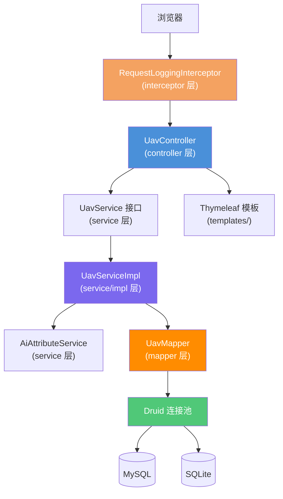

# 无人机信息管理系统 技术设计文档

> **关联需求**：[../01-product-specs/uav-management-spec.md](../01-product-specs/uav-management-spec.md)
> **文档状态**：已确认
> **创建时间**：2026-04-18
> **最后更新**：2026-04-18
> **负责人**：开发团队

---

## 概述

本系统基于 Spring Boot 2.2.x + Apache Shiro + MyBatis 3.5.x 构建，采用 Thymeleaf 服务端渲染页面，
参考 RuoYi 系统风格实现无人机信息 CRUD 管理。数据库层通过 Druid 连接池 + 配置文件切换支持 MySQL 与 SQLite 双模式，
AI 属性生成功能通过 Service 层封装对 AI 接口的调用实现。

---

## 一、项目目录结构

```
uav-management/
├── src/
│   ├── main/
│   │   ├── java/com/example/uav/
│   │   │   ├── UavManagementApplication.java      # 启动类
│   │   │   ├── config/                            # 配置层
│   │   │   │   ├── ShiroConfig.java               # Shiro 安全配置
│   │   │   │   ├── DruidConfig.java               # Druid 数据源配置（双库切换）
│   │   │   │   ├── MybatisConfig.java             # MyBatis 注解配置
│   │   │   │   └── WebMvcConfig.java              # MVC 配置（拦截器注册）
│   │   │   ├── interceptor/                       # 拦截器（独立包）
│   │   │   │   ├── RequestLoggingInterceptor.java # 请求日志拦截器
│   │   │   │   └── ShiroAuthInterceptor.java      # 认证拦截（Shiro Filter 补充）
│   │   │   ├── controller/                        # 控制层
│   │   │   │   ├── UavController.java             # 无人机 CRUD 控制器
│   │   │   │   └── AiGenerateController.java      # AI 属性生成控制器
│   │   │   ├── service/                           # 业务层接口
│   │   │   │   ├── UavService.java                # 无人机服务接口
│   │   │   │   └── AiAttributeService.java        # AI 生成属性服务接口
│   │   │   ├── service/impl/                      # 业务层实现（独立子包）
│   │   │   │   ├── UavServiceImpl.java
│   │   │   │   └── AiAttributeServiceImpl.java
│   │   │   ├── mapper/                            # 数据访问层接口（MyBatis Mapper）
│   │   │   │   └── UavMapper.java
│   │   │   ├── mapper/impl/                       # Mapper 实现（可选，注解直接写在接口上）
│   │   │   ├── domain/                            # 领域层
│   │   │   │   ├── entity/
│   │   │   │   │   └── Uav.java                  # 无人机实体
│   │   │   │   ├── dto/
│   │   │   │   │   ├── UavDTO.java               # 查询/响应 DTO
│   │   │   │   │   ├── UavCreateRequest.java      # 新增请求 DTO
│   │   │   │   │   └── UavUpdateRequest.java      # 修改请求 DTO
│   │   │   │   └── query/
│   │   │   │       └── UavQuery.java              # 列表查询条件
│   │   │   ├── common/                            # 公共工具
│   │   │   │   ├── R.java                         # 统一响应封装（参考 RuoYi）
│   │   │   │   ├── PageResult.java                # 分页结果封装
│   │   │   │   └── Constants.java                 # 全局常量
│   │   │   └── exception/                         # 异常处理
│   │   │       ├── BusinessException.java          # 业务异常
│   │   │       └── GlobalExceptionHandler.java     # 全局异常处理器（@ControllerAdvice）
│   │   ├── resources/
│   │   │   ├── application.yml                    # 主配置（激活 profile）
│   │   │   ├── application-mysql.yml              # MySQL 数据源配置
│   │   │   ├── application-sqlite.yml             # SQLite 数据源配置
│   │   │   ├── mapper/                            # MyBatis XML（仅复杂查询使用）
│   │   │   │   └── UavMapper.xml
│   │   │   └── templates/                         # Thymeleaf 模板
│   │   │       ├── layout/
│   │   │       │   └── main.html                  # 基础布局（Bootstrap 3.3.7）
│   │   │       └── uav/
│   │   │           ├── list.html                  # 无人机列表页
│   │   │           ├── add.html                   # 新增页
│   │   │           └── edit.html                  # 编辑页
│   └── test/
│       └── java/com/example/uav/
│           ├── service/impl/UavServiceImplTest.java
│           ├── controller/UavControllerTest.java
│           └── mapper/UavMapperTest.java
├── pom.xml
└── ...
```

---

## 二、架构设计

### 组件关系图



### 分层依赖约束

| 层级 | 包路径 | 允许依赖 | 禁止依赖 |
|------|--------|----------|----------|
| controller | `com.example.uav.controller` | service 接口 | mapper、entity 直接持久化 |
| service（接口） | `com.example.uav.service` | domain | controller、mapper |
| service（实现） | `com.example.uav.service.impl` | mapper 接口、domain | controller |
| mapper | `com.example.uav.mapper` | domain.entity | controller、service |
| interceptor | `com.example.uav.interceptor` | common | 任何业务层 |
| config | `com.example.uav.config` | 所有层 | — |
| domain | `com.example.uav.domain` | 无（纯 POJO） | 所有其他层 |
| common | `com.example.uav.common` | 无 | 业务层 |
| exception | `com.example.uav.exception` | 无 | 业务层 |

### 请求处理流程

```
浏览器请求
  → RequestLoggingInterceptor（打印请求路径、方法、IP、耗时）
  → Shiro Filter（校验登录态）
  → UavController（接收参数、@Valid 校验）
  → UavService 接口
  → UavServiceImpl（业务逻辑，调用 Mapper）
  → UavMapper（MyBatis 注解 SQL / XML SQL）
  → Druid 连接池 → 数据库（MySQL 或 SQLite）
  → 返回 R<UavDTO> / 跳转 Thymeleaf 模板
```

---

## 三、数据库双源切换设计

### 切换机制

通过 Spring Boot 的 `spring.profiles.active` 激活不同数据源配置，无需修改任何 Java 代码：

```yaml
# application.yml（主配置）
spring:
  profiles:
    active: mysql   # 切换为 sqlite 即可使用 SQLite
```

```yaml
# application-mysql.yml
spring:
  datasource:
    type: com.alibaba.druid.pool.DruidDataSource
    driver-class-name: com.mysql.cj.jdbc.Driver
    url: jdbc:mysql://localhost:3306/uav_db?useUnicode=true&characterEncoding=utf8&serverTimezone=Asia/Shanghai
    username: root
    password: root
```

```yaml
# application-sqlite.yml
spring:
  datasource:
    type: com.alibaba.druid.pool.DruidDataSource
    driver-class-name: org.sqlite.JDBC
    url: jdbc:sqlite:./data/uav.db
    username:
    password:
```

### 兼容性 SQL 原则

- 主键策略：使用雪花 ID 或自增（SQLite auto_increment 与 MySQL 一致）
- 时间字段：统一使用 `DATETIME` 类型，代码层用 `LocalDateTime`
- 分页：MyBatis 使用 `PageHelper` 插件，自动适配不同方言

---

## 四、数据模型

### 实体类：`Uav`（对应表：`t_uav`）

| 字段名 | Java 类型 | 数据库类型 | 约束 | 说明 |
|--------|-----------|-----------|------|------|
| id | Long | BIGINT / INTEGER | PK, AUTO_INCREMENT | 主键 |
| uavCode | String | VARCHAR(64) | NOT NULL, UNIQUE | 无人机注册编号 |
| model | String | VARCHAR(100) | NOT NULL | 型号 |
| manufacturer | String | VARCHAR(100) | NULL | 制造商 |
| maxPayload | Double | DOUBLE | NULL | 最大载重（kg） |
| maxAltitude | Integer | INT | NULL | 最大飞行高度（m） |
| maxFlightTime | Integer | INT | NULL | 最大续航时长（min） |
| maxSpeed | Double | DOUBLE | NULL | 最大速度（m/s） |
| wingspan | Double | DOUBLE | NULL | 翼展（cm） |
| weight | Double | DOUBLE | NULL | 自重（kg） |
| status | Integer | TINYINT | NOT NULL, DEFAULT 1 | 状态：1-正常，0-停用 |
| remark | String | VARCHAR(500) | NULL | 备注 |
| aiGenerated | Integer | TINYINT | NOT NULL, DEFAULT 0 | 0-手动录入，1-AI生成 |
| createdAt | LocalDateTime | DATETIME | NOT NULL | 创建时间 |
| updatedAt | LocalDateTime | DATETIME | NOT NULL | 更新时间 |
| deleted | Integer | TINYINT | NOT NULL, DEFAULT 0 | 逻辑删除：0-正常，1-已删除 |

### 数据库建表 SQL

```sql
-- MySQL 版本
CREATE TABLE `t_uav` (
  `id`              BIGINT        NOT NULL AUTO_INCREMENT        COMMENT '主键',
  `uav_code`        VARCHAR(64)   NOT NULL                       COMMENT '注册编号',
  `model`           VARCHAR(100)  NOT NULL                       COMMENT '型号',
  `manufacturer`    VARCHAR(100)                                 COMMENT '制造商',
  `max_payload`     DOUBLE                                       COMMENT '最大载重(kg)',
  `max_altitude`    INT                                          COMMENT '最大飞行高度(m)',
  `max_flight_time` INT                                          COMMENT '最大续航(min)',
  `max_speed`       DOUBLE                                       COMMENT '最大速度(m/s)',
  `wingspan`        DOUBLE                                       COMMENT '翼展(cm)',
  `weight`          DOUBLE                                       COMMENT '自重(kg)',
  `status`          TINYINT       NOT NULL DEFAULT 1             COMMENT '状态:1正常,0停用',
  `remark`          VARCHAR(500)                                 COMMENT '备注',
  `ai_generated`    TINYINT       NOT NULL DEFAULT 0             COMMENT '0手动,1AI生成',
  `created_at`      DATETIME      NOT NULL DEFAULT CURRENT_TIMESTAMP COMMENT '创建时间',
  `updated_at`      DATETIME      NOT NULL DEFAULT CURRENT_TIMESTAMP ON UPDATE CURRENT_TIMESTAMP COMMENT '更新时间',
  `deleted`         TINYINT       NOT NULL DEFAULT 0             COMMENT '逻辑删除',
  PRIMARY KEY (`id`),
  UNIQUE KEY `uk_uav_code` (`uav_code`),
  KEY `idx_model` (`model`),
  KEY `idx_status` (`status`)
) ENGINE=InnoDB DEFAULT CHARSET=utf8mb4 COMMENT='无人机信息表';
```

```sql
-- SQLite 版本（兼容版，字段含义相同）
CREATE TABLE IF NOT EXISTS t_uav (
  id              INTEGER PRIMARY KEY AUTOINCREMENT,
  uav_code        TEXT    NOT NULL UNIQUE,
  model           TEXT    NOT NULL,
  manufacturer    TEXT,
  max_payload     REAL,
  max_altitude    INTEGER,
  max_flight_time INTEGER,
  max_speed       REAL,
  wingspan        REAL,
  weight          REAL,
  status          INTEGER NOT NULL DEFAULT 1,
  remark          TEXT,
  ai_generated    INTEGER NOT NULL DEFAULT 0,
  created_at      TEXT    NOT NULL DEFAULT (datetime('now','localtime')),
  updated_at      TEXT    NOT NULL DEFAULT (datetime('now','localtime')),
  deleted         INTEGER NOT NULL DEFAULT 0
);
```

### DTO 定义

**`UavDTO`（查询响应）**

| 字段 | 类型 | 说明 |
|------|------|------|
| id | Long | 主键 |
| uavCode | String | 注册编号 |
| model | String | 型号 |
| manufacturer | String | 制造商 |
| maxPayload | Double | 最大载重 |
| maxAltitude | Integer | 最大飞行高度 |
| maxFlightTime | Integer | 最大续航 |
| maxSpeed | Double | 最大速度 |
| wingspan | Double | 翼展 |
| weight | Double | 自重 |
| status | Integer | 状态 |
| aiGenerated | Integer | 是否AI生成 |
| remark | String | 备注 |
| createdAt | String | 创建时间（格式：yyyy-MM-dd HH:mm:ss） |

**`UavCreateRequest`（新增请求）**

| 字段 | 类型 | 校验 | 说明 |
|------|------|------|------|
| uavCode | String | `@NotBlank @Size(max=64)` | 注册编号 |
| model | String | `@NotBlank @Size(max=100)` | 型号 |
| manufacturer | String | `@Size(max=100)` | 制造商 |
| maxPayload | Double | `@Min(0)` | 最大载重 |
| maxAltitude | Integer | `@Min(0)` | 最大飞行高度 |
| maxFlightTime | Integer | `@Min(0)` | 最大续航 |
| maxSpeed | Double | `@Min(0)` | 最大速度 |
| wingspan | Double | `@Min(0)` | 翼展 |
| weight | Double | `@Min(0)` | 自重 |
| remark | String | `@Size(max=500)` | 备注 |

**`UavQuery`（查询条件）**

| 字段 | 类型 | 说明 |
|------|------|------|
| model | String | 型号（模糊） |
| uavCode | String | 注册编号（精确） |
| status | Integer | 状态筛选 |
| pageNum | Integer | 页码，默认1 |
| pageSize | Integer | 每页数量，默认10 |

---

## 五、接口定义（Web MVC + 页面路由）

### 页面路由（Thymeleaf）

| 方法 | 路径 | 描述 | 模板 |
|------|------|------|------|
| GET | `/uav/list` | 无人机列表页 | `uav/list.html` |
| GET | `/uav/add` | 新增表单页 | `uav/add.html` |
| GET | `/uav/edit/{id}` | 编辑表单页 | `uav/edit.html` |

### REST API（Ajax 调用）

| 方法 | 路径 | 描述 | 请求体 | 响应 |
|------|------|------|--------|------|
| GET | `/api/uav/list` | 分页查询列表 | `UavQuery`（参数） | `R<PageResult<UavDTO>>` |
| GET | `/api/uav/{id}` | 按 ID 查询 | — | `R<UavDTO>` |
| POST | `/api/uav` | 新增无人机 | `UavCreateRequest` | `R<Void>` |
| PUT | `/api/uav/{id}` | 修改无人机 | `UavUpdateRequest` | `R<Void>` |
| DELETE | `/api/uav/{id}` | 逻辑删除 | — | `R<Void>` |
| GET | `/api/uav/ai-generate` | AI 生成无人机属性 | `model`（参数） | `R<UavDTO>` |

### 统一响应格式 `R<T>`（参考 RuoYi）

```json
{
  "code": 200,
  "msg": "操作成功",
  "data": { ... }
}
```

---

## 六、拦截器设计

> 拦截器均在 `com.example.uav.interceptor` 包下，通过 `WebMvcConfig` 注册。

### RequestLoggingInterceptor（请求日志拦截器）

- **触发**：所有请求（`/**`），排除静态资源
- **打印内容**：
  - 请求进入时：`[REQ] {METHOD} {URI} | IP={ip} | Params={params}`
  - 请求完成时：`[RES] {METHOD} {URI} | Status={status} | Cost={ms}ms`
- **实现方式**：实现 `HandlerInterceptor`，`preHandle` 记录开始时间（`request.setAttribute`），`afterCompletion` 计算耗时

### ShiroAuthInterceptor（认证补充拦截器，可选）

- **触发**：业务路径 `/uav/**`、`/api/**`
- **行为**：验证 Shiro `Subject.isAuthenticated()`，未登录重定向 `/login`

---

## 七、技术选型汇总

| 技术 | 版本 | 用途 |
|------|------|------|
| Spring Boot | 2.2.x | 应用框架，自动配置 |
| Spring Framework | 5.2.x | IoC/MVC 核心 |
| Apache Shiro | 1.7 | 认证与权限控制 |
| Apache MyBatis | 3.5.x | 持久层 ORM |
| PageHelper | 1.3.x | MyBatis 分页插件，自动适配 MySQL/SQLite |
| Hibernate Validator | 6.0.x | 请求参数校验（`@Valid`） |
| Alibaba Druid | 1.2.x | 连接池 + SQL 监控 |
| Thymeleaf | 3.0.x | 服务端 HTML 渲染 |
| Bootstrap | 3.3.7 | 前端 UI 框架（RuoYi 风格） |
| SQLite JDBC | 3.36.x | SQLite 数据库驱动 |
| MySQL Connector/J | 8.0.x | MySQL 驱动 |
| Lombok | 1.18.x | 简化 POJO 样板代码 |

---

## 八、AI 属性生成设计

### 策略

`AiAttributeService` 接口定义生成合同，`AiAttributeServiceImpl` 实现以下策略（可配置切换）：

1. **规则生成（默认）**：根据型号关键词（如"消费级"、"工业级"、"军用级"）匹配预设规格范围，随机生成合理数值
2. **外部 AI API**（扩展）：预留调用 OpenAI / 国内大模型 REST API 的接口，通过 `ai.provider` 配置激活

```java
// AiAttributeService 接口
public interface AiAttributeService {
    /**
     * 根据无人机型号自动生成属性。
     *
     * @param model 无人机型号描述
     * @return 填充了属性字段的 UavDTO（id 为 null，待用户确认后保存）
     */
    UavDTO generateAttributes(String model);
}
```

---

## 九、安全设计（Apache Shiro）

### Shiro 配置策略（`ShiroConfig.java`，全注解）

```
/static/**           → anon（静态资源）
/login               → anon（登录页）
/api/uav/ai-generate → authc（需登录）
/uav/**              → authc（需登录）
/api/**              → authc（需登录）
/**                  → authc（兜底）
```

- Realm：自定义 `UavUserRealm extends AuthorizingRealm`，从数据库验证凭证
- Session 管理：`DefaultWebSessionManager`，Session 超时 30 分钟

---

## 十、风险与注意事项

| 风险 | 影响 | 应对策略 |
|------|------|----------|
| SQLite 不支持 `ON UPDATE CURRENT_TIMESTAMP` | 中 | `UavServiceImpl` 在更新时手动设置 `updatedAt = LocalDateTime.now()` |
| SQLite 并发写入性能差 | 低（开发环境） | SQLite 仅用于开发/演示，生产使用 MySQL |
| AI 生成属性合理性 | 中 | 对生成结果加入范围校验，超出合理区间时返回默认值 |
| Shiro 1.7 与 Spring Boot 2.2.x 兼容性 | 低 | 使用 `shiro-spring-boot-web-starter 1.7.1`，已验证兼容 |

---

## 十一、测试策略

| 测试类型 | 测试类 | 框架 | 覆盖场景 |
|----------|--------|------|----------|
| Service 单元测试 | `UavServiceImplTest` | Mockito | CRUD 正常流程、注册号重复异常、逻辑删除 |
| Controller 切片测试 | `UavControllerTest` | `@WebMvcTest` | 参数校验、响应格式、404 处理 |
| Mapper 测试 | `UavMapperTest` | `@MybatisTest` (SQLite H2) | 分页查询、模糊搜索、逻辑删除过滤 |
| AI 服务单元测试 | `AiAttributeServiceImplTest` | Mockito | 规则生成覆盖三种级别、边界型号 |

---

## 变更记录

| 版本 | 日期 | 变更内容 | 变更人 |
|------|------|----------|--------|
| v1.0 | 2026-04-18 | 初始设计文档，覆盖完整系统架构 | 开发团队 |
